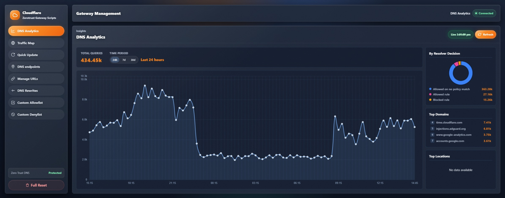
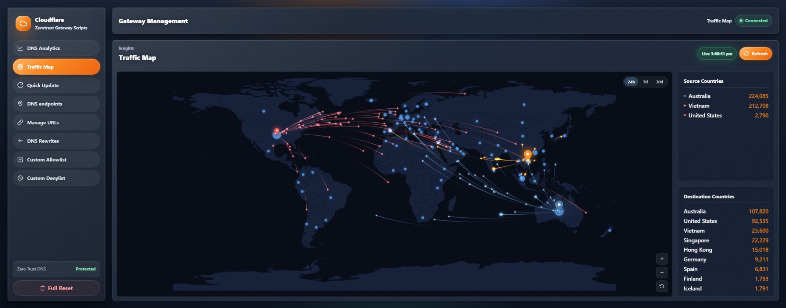
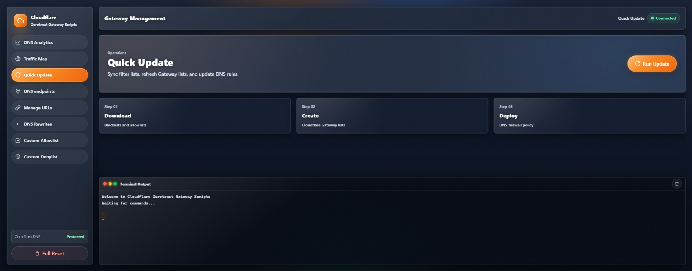
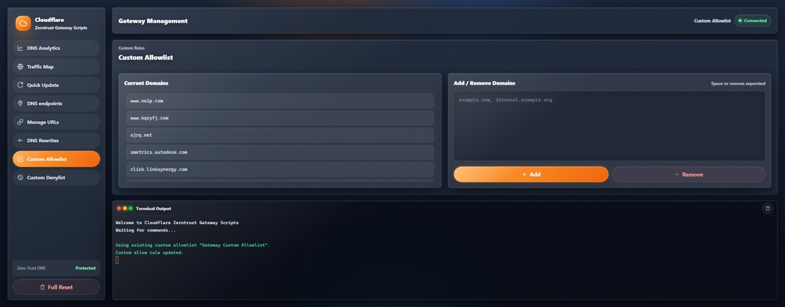

# Cloudflare Zero Trust Gateway Scripts Dashboard

Cloudflare Zero Trust Gateway Scripts (CZGS) helps you build, maintain, and manage Cloudflare Gateway DNS filter lists from public blocklists and allowlists. The project includes a web dashboard, a terminal menu, Docker deployment files, and direct Node.js scripts for automation-focused workflows.

The dashboard can download configured lists, normalize domains, sync Cloudflare Gateway lists, create or update Gateway firewall rules, manage list source URLs, manage a custom allowlist, and review DNS traffic-map data.

## Project Foundation

This project builds on the backend foundation provided by [`mrrfv/cloudflare-gateway-pihole-scripts`](https://github.com/mrrfv/cloudflare-gateway-pihole-scripts). The backend has been adapted and extended to support this project's configuration model, dashboard workflow, Cloudflare Zero Trust Gateway automation, Docker deployment approach, and tailored management features.

## Acknowledgements

- Backend foundation inspired by and adapted from [`mrrfv/cloudflare-gateway-pihole-scripts`](https://github.com/mrrfv/cloudflare-gateway-pihole-scripts).
- This project was heavily developed using AI-assisted workflows and vibe coding techniques to accelerate prototyping, feature development, refactoring, and documentation.

## Web Interface

### DNS Analytics



Real-time DNS analytics dashboard with resolver decisions, traffic insights, top queried domains, and historical activity visualization.

---

### Traffic Map



Interactive global traffic map showing DNS activity flows, source countries, destination countries, and geographic traffic distribution.

---

### Quick Update Workflow



One-click workflow for downloading blocklists, synchronizing Cloudflare Gateway lists, and deploying DNS firewall policies.

---

### Custom Allowlist Management



Dashboard interface for managing custom allowlist entries with real-time terminal output and Gateway rule synchronization.

## Features

- Web dashboard on port `3333`
- Real-time terminal output through Socket.IO
- Cloudflare API credential setup through `.env` or environment variables
- Blocklist and allowlist URL management
- Custom allowlist management with an allow rule
- Traffic-map history using Cloudflare analytics and local SQLite snapshots
- Docker and Docker Compose support
- Direct CLI scripts for automation and advanced use

## Dashboard Security

Localhost access works without a password. Remote dashboard access is blocked by default unless you set `DASHBOARD_PASSWORD` or explicitly set `DASHBOARD_AUTH_DISABLED=1`.

What this means in practice:

1. On your own machine, opening `http://127.0.0.1:3333` or `http://localhost:3333` works without dashboard login by default.
2. If you publish the dashboard through Docker port mapping, a VPS public IP, a reverse proxy, or any non-localhost address, the app will reject access unless you set `DASHBOARD_PASSWORD`.
3. When `DASHBOARD_PASSWORD` is set, the dashboard uses HTTP Basic Auth.
4. `DASHBOARD_AUTH_DISABLED=1` should only be used when another trusted layer already protects the app, such as Cloudflare Access, a private VPN, Tailscale, or an internal-only reverse proxy.

Recommended patterns:

1. Local development only:
   Leave `DASHBOARD_PASSWORD` empty and use `http://localhost:3333`.
2. Docker on a remote host:
   Set both `DASHBOARD_USERNAME` and `DASHBOARD_PASSWORD`, then avoid exposing port `3333` directly unless you also trust the network path.
3. Cloudflare Tunnel or reverse proxy:
   Keep `DASHBOARD_PASSWORD` enabled unless Cloudflare Access, a VPN, or another trusted access layer already protects the dashboard.
4. Fully private network:
   `DASHBOARD_AUTH_DISABLED=1` is reasonable only if the service is unreachable from untrusted clients.

If you deploy this on a VPS or any shared network, set a dashboard password and avoid exposing port `3333` directly to the public internet.

Recommended protection:

1. Set `DASHBOARD_PASSWORD`.
2. Keep the dashboard behind a private network, VPN, or Cloudflare Tunnel.
3. Put Cloudflare Access in front of the tunnel when publishing it through Cloudflare.
4. Never commit `.env`, `allowlist.txt`, `blocklist.txt`, or other generated/local files.

Basic auth protects the dashboard application, but it should still be served through HTTPS or Cloudflare Access when used remotely.

Example remote `.env` settings:

```ini
DASHBOARD_USERNAME=admin
DASHBOARD_PASSWORD=choose_a_long_random_password
# Leave this at 0 unless another trusted access layer protects the app
DASHBOARD_AUTH_DISABLED=0
```
